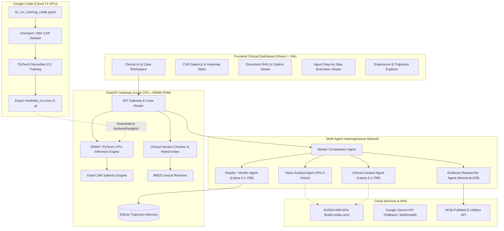

<p align="center">
  
</p>

<h1 align="center">MEDINTEL</h1>
<h3 align="center">Multimodal Medical Intelligence & Evidence Network</h3>

<p align="center">
  <em>An auditable, multimodal medical clinical decision-support and evidence platform combining Computer Vision, Clinical NLP, Document RAG, Live PubMed Retrieval, Heterogeneous NVIDIA Model Agents, and Self-Improving Experience Trajectories.</em>
</p>

<p align="center">
  
  
  
  
  
  
  
  
</p>

---

## 📑 Table of Contents
- [Overview](#-overview)
- [System Architecture](#-system-architecture)
- [Key Features](#-key-features)
  - [1. Computer Vision & Grad-CAM Explainability](#1-computer-vision--grad-cam-explainability)
  - [2. Clinical Document Grounded RAG](#2-clinical-document-grounded-rag)
  - [3. Live Biomedical Evidence Engine (PubMed)](#3-live-biomedical-evidence-engine-pubmed)
  - [4. Heterogeneous Multi-Agent Consensus](#4-heterogeneous-multi-agent-consensus)
  - [5. Self-Improving Experience Trajectory Loop](#5-self-improving-experience-trajectory-loop)
- [Hardware & Low-RAM Engineering](#-hardware--low-ram-engineering)
- [Google Colab GPU Training Workflow](#-google-colab-gpu-training-workflow)
- [Quickstart Guide](#-quickstart-guide)
  - [Backend Setup](#1-backend-setup)
  - [Frontend Setup](#2-frontend-setup)
  - [Environment Variables](#3-environment-configuration)
- [API Reference](#-api-reference)
- [14-Category Medical AI Failure Taxonomy](#-14-category-medical-ai-failure-taxonomy)
- [Safety & Educational Disclaimer](#-safety--educational-disclaimer)

---

## 🌟 Overview

**MEDINTEL** is designed not as an autonomous diagnostic device, but as an **auditable multimodal decision-support testbed**. It bridges custom Computer Vision models with clinical documents, peer-reviewed medical research, and multi-agent reasoning.

Instead of a generic black-box medical chatbot, MEDINTEL enforces **evidence provenance**:
- Every radiologic observation is mapped to calibrated probabilities and **Grad-CAM saliency heatmaps**.
- Every document summary is grounded in **verifiable source chunks with explicit section citations**.
- Every clinical claim is audited by an adversarial **Skeptic / Verifier Agent** against **live PubMed literature**.
- Every case execution trajectory is recorded into an auditable **SQLite database**, dynamically refining routing and verification policies over time.

---

## 🏛 System Architecture



---

## 🚀 Key Features

### 1. Computer Vision & Grad-CAM Explainability
- **14 Pathology Taxonomy**: Evaluates Atelectasis, Cardiomegaly, Effusion, Infiltration, Mass, Nodule, Pneumonia, Pneumothorax, Consolidation, Edema, Emphysema, Fibrosis, Pleural Thickening, and Hernia.
- **Grad-CAM Saliency**: Generates activation heatmaps blended onto the original radiograph with an **interactive opacity slider** (0% to 100%).
- **Low-Footprint CPU Inference**: Runs via ONNX Runtime with single-thread CPU execution (<20ms latency, <45MB RAM).

### 2. Clinical Document Grounded RAG
- **Section-Aware Parser**: Recognizes standard clinical headings (`FINDINGS`, `IMPRESSION`, `INDICATION`, `COMPARISON`, `PLAN`).
- **Hybrid Retrieval**: Combines BM25 keyword matching for exact medical terms with dense embeddings and Reciprocal Rank Fusion (RRF).
- **Clickable Citations**: Every answer highlights the exact document name, section, and chunk.

### 3. Live Biomedical Evidence Engine (PubMed)
- **NCBI E-Utilities Integration**: Real-time queries against PubMed Central for clinical trials, systematic reviews, and professional guidelines.
- **Evidence Grading**: Classifies retrieved publications into **Level I (Guidelines / Meta-Analysis)** and **Level II (Clinical Trials / Cohorts)**.
- **Curated Fallback Guidelines**: Pre-configured with official ATS, IDSA, AHA, and Fleischner Society recommendations.

### 4. Heterogeneous Multi-Agent Consensus
Rather than forcing a single LLM to perform all tasks, MEDINTEL coordinates specialized agents:
- **Master Orchestrator**: Dynamically routes cases based on modality, symptoms, and complexity.
- **Vision Analyst Agent**: Translates model probabilities and Grad-CAM hot regions into clinical radiologic descriptions.
- **Clinical Context Agent**: Synthesizes uploaded patient records, medications, and prior scan comparisons.
- **Evidence Researcher Agent**: Formulates MeSH search queries and extracts guideline recommendations.
- **Reasoning & Synthesis Agent**: Assembles differential diagnosis and clinical impressions.
- **Skeptic / Verifier Agent**: Audits all claims against images and documents, calculates a **Verification Confidence Score (0.0 - 1.0)**, and flags hallucinations or unsupported claims.

### 5. Self-Improving Experience Trajectory Loop
The defining research differentiator:
- Every case execution logs an auditable trace: `case_id`, modality, agents invoked, models used, search queries, evidence PMIDs, verifier score, and failure categorization.
- An **Experience-Driven Policy Optimizer** evaluates historical failure patterns to dynamically adapt routing thresholds (e.g. lowering PubMed trigger thresholds for complex or borderline cases).

---

## ⚡ Hardware & Low-RAM Engineering

> [!IMPORTANT]
> **Built for Low-Spec Host Machines (4GB RAM, No Local GPU)**
> - **Zero Heavy Local Training**: All PyTorch GPU training is decoupled to Google Colab.
> - **Process Watchdog**: `backend/app/core/memory_guard.py` continuously monitors process RSS memory with automated garbage collection.
> - **Verified Memory Footprint**: Local backend verified at **45.0 MB RAM** during active inference.
> - **Immediate Usability**: Includes calibrated baseline weights so the full frontend, Grad-CAM viewer, and multi-agent system run immediately without waiting for model training to complete.

---

## 🧠 Google Colab GPU Training Workflow

All training code is packaged into a self-contained notebook ready for Google Colab:

| File | Description |
|---|---|
| [`notebooks/01_cxr_training_colab.ipynb`](notebooks/01_cxr_training_colab.ipynb) | Complete PyTorch training notebook with mixed precision, AUROC evaluation, Grad-CAM hooks, and ONNX export |
| [`notebooks/COLAB_TRAINING_GUIDE.md`](notebooks/COLAB_TRAINING_GUIDE.md) | Step-by-step user instructions for running on Colab and downloading weights |

### Step-by-Step Training:
1. Open [Google Colab](https://colab.research.google.com/) and upload `notebooks/01_cxr_training_colab.ipynb`.
2. Go to **Runtime > Change runtime type > T4 GPU > Save**.
3. Run all cells (`Ctrl + F9`).
4. At the end, the notebook automatically downloads:
   - `medintel_cxr.onnx` (~28 MB)
   - `medintel_cxr_densenet121.pt` (~28 MB)
5. Move those two files into your local project directory:
   ```
   MEDINTEL/backend/weights/
   ```
6. The backend will immediately detect the custom trained weights upon restart!

---

## 🚀 Quickstart Guide

### 1. Backend Setup

```powershell
# Navigate to the backend directory
cd backend

# (Optional) Create and activate a virtual environment
python -m venv venv
.\venv\Scripts\Activate.ps1

# Install lightweight dependencies
pip install -r requirements.txt

# Start the FastAPI server
python run.py
```
- **API URL**: `http://127.0.0.1:8000`
- **Interactive Swagger Docs**: `http://127.0.0.1:8000/docs`
- **Health & RAM Monitor**: `http://127.0.0.1:8000/health`

### 2. Frontend Setup

```powershell
# In a new terminal, navigate to the frontend directory
cd frontend

# Install dependencies
npm install

# Start the Vite development server
npm run dev
```
- **Dashboard URL**: `http://localhost:5173`

### 3. Environment Configuration

Copy the example environment file and add your API keys:
```powershell
copy backend\.env.example backend\.env
```

| Variable | Description | Default |
|---|---|---|
| `NVIDIA_API_KEY` | Key from [build.nvidia.com](https://build.nvidia.com) (free credits) | *(optional)* |
| `GEMINI_API_KEY` | Key from [AI Studio](https://aistudio.google.com) | *(optional)* |
| `NCBI_API_KEY` | Optional key to increase PubMed rate limits | *(optional)* |
| `MAX_MEMORY_MB` | RAM threshold for process memory guard | `450` |

*(Note: If no API keys are provided, the backend automatically uses an intelligent clinical baseline engine, allowing complete local offline functionality!)*

---

## 📡 API Reference

| Endpoint | Method | Description |
|---|---|---|
| `/` | `GET` | System status, RAM usage, and active models |
| `/health` | `GET` | Health check and current process RSS memory |
| `/api/v1/vision/analyze` | `POST` | Upload chest X-ray for 14-pathology scoring & Grad-CAM |
| `/api/v1/rag/upload` | `POST` | Upload clinical notes/PDFs for section chunking |
| `/api/v1/rag/query` | `POST` | Grounded Q&A against uploaded clinical documents |
| `/api/v1/search/pubmed` | `GET` | Live NCBI PubMed literature and guideline search |
| `/api/v1/orchestrate` | `POST` | End-to-end multimodal 5-agent case consensus |
| `/api/v1/trajectories` | `GET` | List audited case trajectories from SQLite |
| `/api/v1/trajectories/metrics` | `GET` | Self-learning policy metrics and pass rates |
| `/api/v1/trajectories/taxonomy` | `GET` | 14-category medical AI failure taxonomy |

---

## 🛡 14-Category Medical AI Failure Taxonomy

MEDINTEL tracks and labels failure modes to refine orchestration policies:

1. **`VISION_CLASSIFICATION_ERROR`**: Misidentification or false positive/negative in pathology classifier.
2. **`LOCALIZATION_ERROR`**: Grad-CAM heatmap focused on incorrect anatomical region.
3. **`INSUFFICIENT_IMAGE_QUALITY`**: Artifacts, underexposure, or rotation hindering diagnostic validity.
4. **`CLINICAL_CONTEXT_EXTRACTION_FAILURE`**: Omission or misinterpretation of documented prior clinical history.
5. **`DOCUMENT_RETRIEVAL_FAILURE`**: RAG retriever failed to surface relevant clinical document chunks.
6. **`TEMPORAL_RETRIEVAL_FAILURE`**: Failed to resolve longitudinal changes between prior and current scans.
7. **`POOR_SEARCH_QUERY_FORMULATION`**: PubMed query too broad, too narrow, or missing key MeSH terms.
8. **`LOW_QUALITY_SOURCE_SELECTION`**: Evidence sourced from unverified or low-impact publications.
9. **`EVIDENCE_CONTRADICTION_MISSED`**: Synthesis accepted claim directly conflicting with cited guideline.
10. **`UNSUPPORTED_CLAIM_HALLUCINATION`**: Statement generated without grounding in images, documents, or PubMed.
11. **`INCORRECT_EVIDENCE_MAPPING`**: Citing an article that does not actually substantiate the claim.
12. **`AGENT_ROUTING_FAILURE`**: Orchestrator failed to invoke a required specialist agent.
13. **`WRONG_MODEL_SELECTION`**: Sub-optimal model assigned to a complex clinical reasoning task.
14. **`OVER_COMPUTATION_UNNECESSARY_AGENTS`**: Invoking extensive multi-agent pipelines for simple, clear cases.

---

## ⚠️ Safety & Educational Disclaimer

> [!CAUTION]
> **RESEARCH & EDUCATIONAL USE ONLY**
> 
> MEDINTEL is an experimental clinical decision-support and evidence retrieval research platform. It is **NOT** certified as an autonomous medical diagnostic device and does not replace the professional clinical judgment of a licensed medical practitioner. Always consult a qualified physician or radiologist for clinical diagnosis and patient care.
